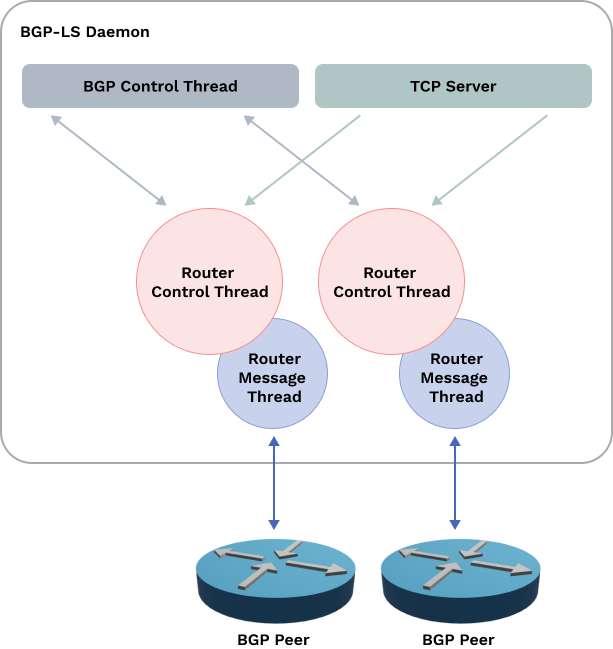

# Software Defined Network demo

This project is a demo of a Software Defined Network (SDN) using FRR, OpenDaylight and Pathman-SR. The goal is to build
a solution wherein users can interact with a GUI to visualize the current network topology. Users should also be able to
specify a path for a data flow, triggering automatic configuration adjustments in the network.


When a packet arrives at the `start` router, there are three possible paths to the `end` router. The same holds true for
a packet coming from the `end` router. The user can choose one of these paths, and the network will be reconfigured
accordingly.

Before path is deployed packets travel via `start` -> `main` -> `end` path:


Then path can be deployed using Pathman-SR:


After path is deployed packets travel via `start` -> `top` -> `end` path:


## Actual topology


## FRR

FRR is chosen as network device. It supports major part of required protocols: IS-IS, MPLS, BGP, PCEP. FRR does
not support BGP-LS at the moment. That is why custom connector is implemented. FRR routers are running in Docker
containers.

## IS-IS, SR and TE

IS-IS is configured for dynamic routing. It is used to exchange reachability information between routers.

Segment Routing (SR) with MPLS data plane is used to steer traffic through the network. To enable MPLS in container we
have to load the following kernel modules:

```bash
sudo modprobe mpls_router
sudo modprobe mpls_gso
sudo modprobe mpls_iptunnel
````

For corresponding interfaces inside and outside containers MPLS must be enabled:

```bash
docker exec main   sysctl -w net.mpls.conf.lo.input=1
docker exec main   sysctl -w net.mpls.conf.eth2.input=1
# ...
docker exec main   sysctl -w net.mpls.platform_labels=1048575
```

MPLS is also a reason why Docker Compose is not used. Even when creating links by hand and using macvlan driver, MPLS
does not work. That is why bash scripts are used to setup the network.

Traffic Engineering (TE) is the concept of using traffic characteristics to make routing decisions, typically aimed at
meeting Service Level Agreements (SLAs).

## ODL

OpenDaylight is used as SDN controller. It supports BGP-LS and PCEP. Ideally if FRR would support BGP-LS, ODL would
connect to a router inside topology and retrieve topology information from it, so no additional connector would be
needed.

## PCEP

FRR supports Path Computation Element Protocol (PCEP). But it is incompatible with the PCEP implementation of
OpenDaylight. [RFC 8664](https://www.rfc-editor.org/info/rfc8664), implemented by FRR, changes the ERO
subobject type from 5 to 36. It makes impossible to parse paths sent by FRR to ODL and vice versa.

In order to make FRR and ODL compatible, we have to patch FRR to use the same ERO subobject type as ODL.

File: `pcep_msg_objects.h`

```c
enum pcep_ro_subobj_types {
	RO_SUBOBJ_TYPE_IPV4 = 1,  /* RFC 3209 */
	RO_SUBOBJ_TYPE_IPV6 = 2,  /* RFC 3209 */
	RO_SUBOBJ_TYPE_LABEL = 3, /* RFC 3209 */
	RO_SUBOBJ_TYPE_UNNUM = 4, /* RFC 3477 */
	RO_SUBOBJ_TYPE_ASN = 32,  /* RFC 3209, Section 4.3.3.4 */
	/* PATCHED 36 -> 5 */
	RO_SUBOBJ_TYPE_SR = 5,    /* RFC 8408, draft-ietf-pce-segment-routing-16.
                               * Type 5 for draft07 has been assigned to
                               * something else. */
	RO_SUBOBJ_UNKNOWN
};
```

## BGP-LS Connector

BGP-LS extends the BGP protocol to announce link information. BGP only announces reachability information, and if a peer
is connected to only one speaker, there is no way to determine which node's prefix it is. In the project this problem is
resolved by BGP-LS Connector which is connected to every node within the topology via BGP. n this way, the BGP-LS
Connector knows the names of the nodes and the prefixes to which they are connected. BGP-LS Connector architecture is
depicted below:



The BGP-LS Connector is written in Go and employs an FRR-like design, with one daemon currently responsible for BGP-LS.
For each connection, two goroutines are spawned by the 'TCP Server' listening on port 1790 (the default BGP port is
179): one for message parsing and another responsible for 'router' logic. In this project, the term 'router' refers to
either a BGP or BGP-LS connection. The 'Router' communicates with the 'BGP Control Thread,' transmitting received
information from the client. The 'BGP Control Thread' decides whether the topology is complete and should be advertised
to the BGP-LS peer. To overcome challenges in identifying correct BGP-LS packets, the packet structure is adopted from
Cisco dCloud.
